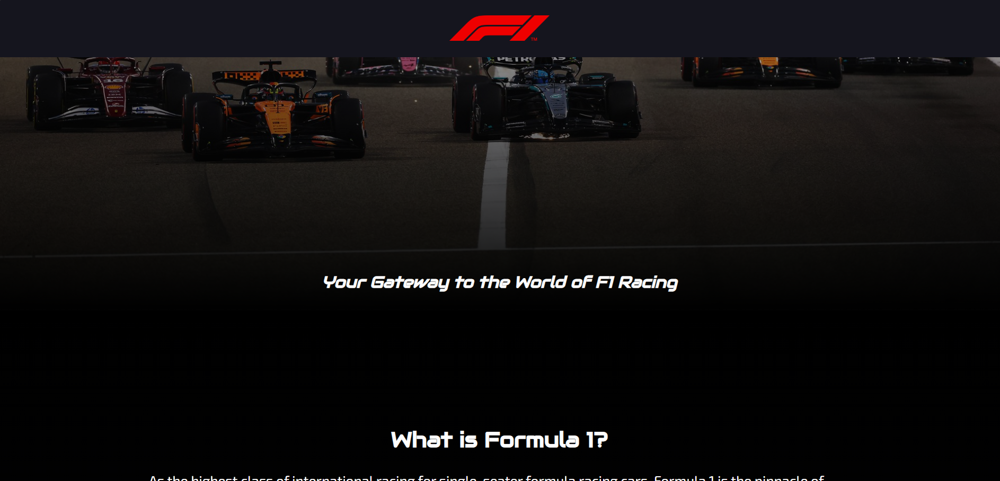
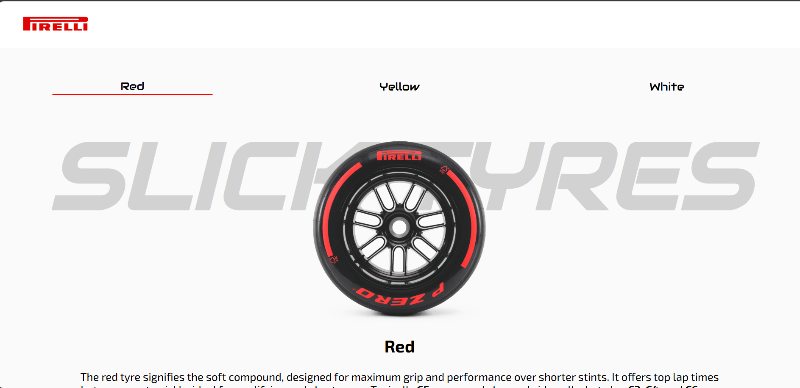
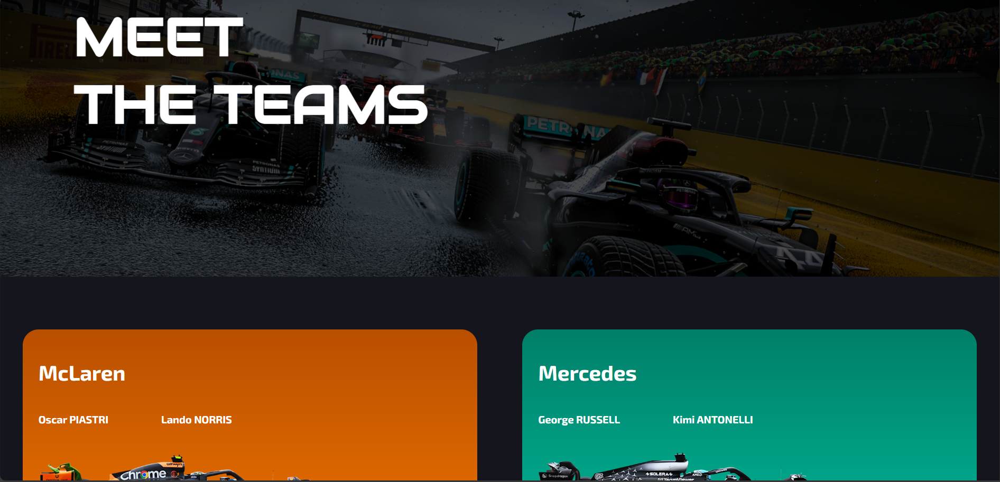
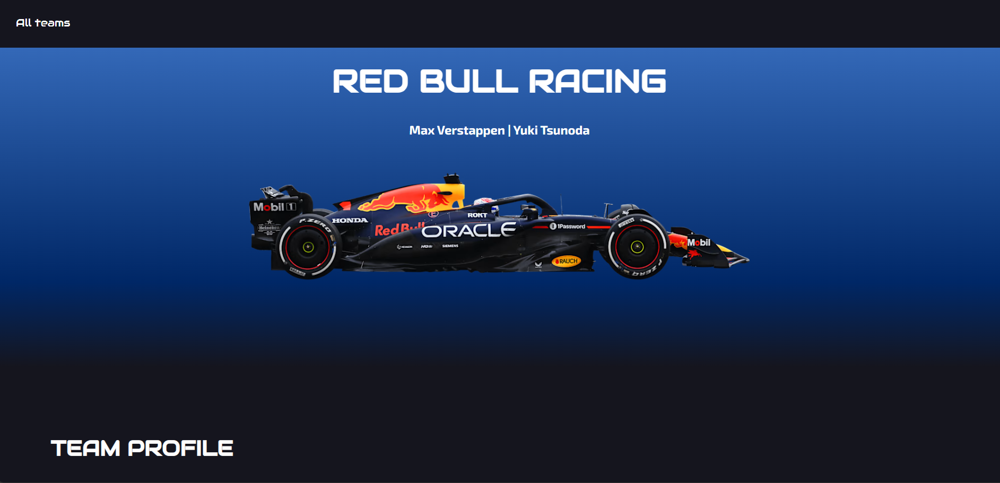

# Formula 1 Informational Website

An interactive, multi-page website built using **HTML, CSS, and Vanilla JavaScript**. This project explains key aspects of Formula 1 such as race weekends, Sprint races, tyre compounds, and teams, while focusing on clean UI, animations, and dynamic content.

---

## Project Overview

This website serves as an educational and engaging guide to Formula 1. It combines static content with dynamic JavaScript-driven interactions such as scroll-based animations, theme changes, and data-driven team pages.

The project is fully frontend-based.

---

### Homepage (index.html)

* Introduction to Formula 1
  
* Explanation of F1 race weekends
  
* Drivers’ & Constructors’ Championships
  
* Scroll-triggered animations using `IntersectionObserver`
  
* Smooth UI transitions

 

### F1 Sprint Page

* Explains Sprint race format
  
* Dynamic theme changes while scrolling
  
* Clean minimal layout
  
 

### Tyres Page (Pirelli)

* Interactive image gallery
  
* Slick & wet tyre explanations
  
* Dynamic tyre selection buttons
  
* Compound cards (C1–C6)

 

### Teams Page

* Displays all current F1 teams
  
* Clickable team cards
  
* Gradient-based team branding

 

### Dynamic Team Page

* Loads team data using URL parameters
  
* Single reusable page for all teams
  
* JS-powered content injection
  
* Dynamic gradients and parallax images

---

## Technologies Used

* **HTML5** – Semantic structure
* **CSS3** – Flexbox, Grid, Animations, Gradients
* **JavaScript (ES6)** –

  * IntersectionObserver
  * DOM manipulation
  * URLSearchParams
  * Dynamic styling via CSS variables

---

## Credits

This project is for **educational purposes only**. All trademarks, logos, and names related to Formula 1 belong to their respective owners.

---
